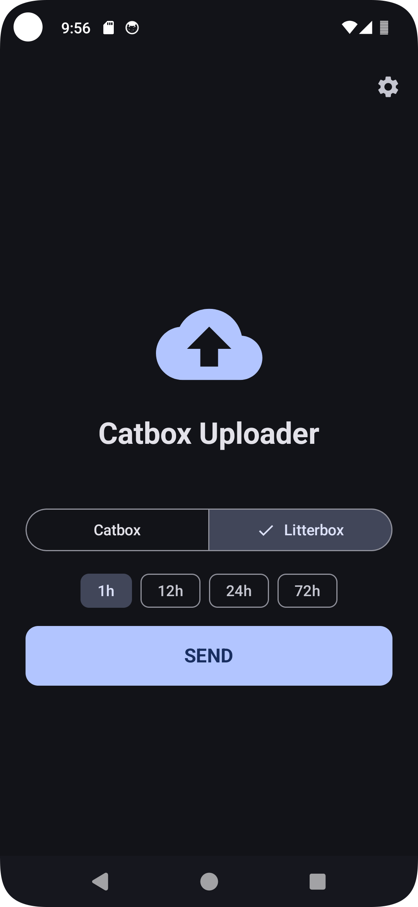
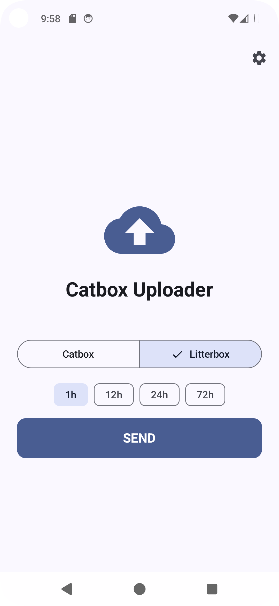
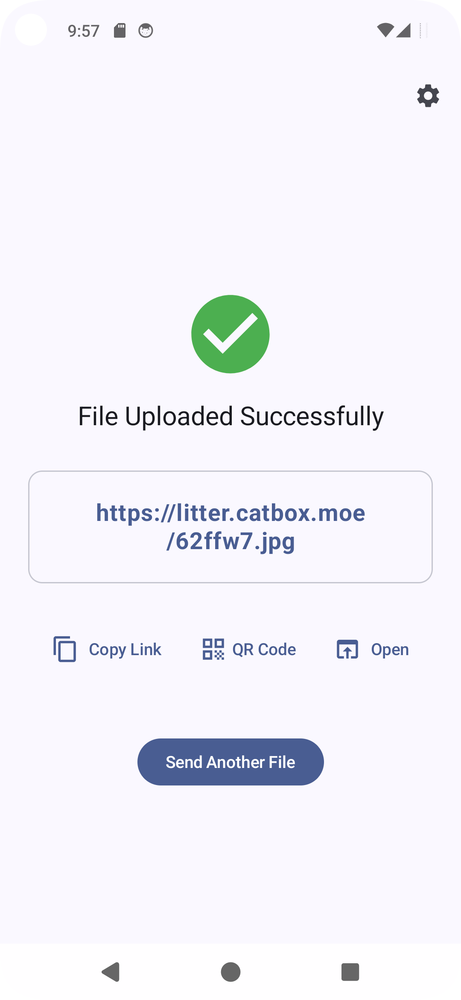
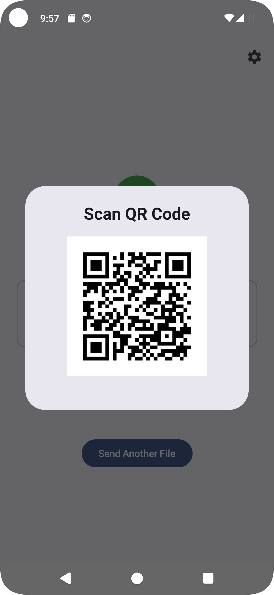

## ⚠Important: If you encounter connection problems, please visit [this website](https://status.catbox.moe/status/catbox) to check the status of catbox.moe. If the problem persists, please report in the issue.
# Catbox Uploader

**Catbox Uploader** is a simple and lightweight Android application that allows you to anonymously host files on the Catbox platform and generate direct download links.

## Features

*   **Lightweight:** The app size is about 1MB.
*   **Anonymous Uploads:** No account required.
*   **Dual Storage Modes:**
    *   **Catbox:** For **permanent** file storage.
    *   **Litterbox:** For **temporary** storage with configurable expiration times.
 
## Screenshots
   

## ⚠️ Disclaimer & Terms of Service

**Please read carefully before use:**

By using this application, you acknowledge and agree to the following:

1. Using this app implies your agreement to Catbox.moe's [Terms of Service and Privacy Policy](https://catbox.moe/legal.php).
2. The developer of this application is **NOT** responsible for the files you upload.
3. You assume full responsibility for your actions. Uploading illegal or policy-violating content is done entirely at your own risk.
4. You must visit **[catbox.moe](https://catbox.moe)** and read their FAQ before using this service.

## License
Licensed under the **MIT License**.
